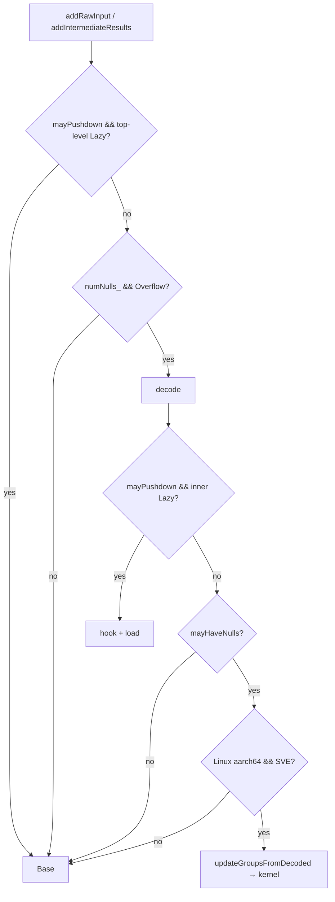

### What problem does this PR solve?

Spark `sum(bigint)` on HashAgg can spend significant time in per-group scalar updates when batches use nullable encodings and the aggregate table tracks null groups. This PR adds an AArch64 SVE batch path for that update loop, with fallback to `SumAggregateBase` for other shapes and platforms.

Issue Number: N/A

### Type of Change

- [ ] 🐛 Bug fix (non-breaking change which fixes an issue)
- [x] ✨ New feature (non-breaking change which adds functionality)
- [x] 🚀 Performance improvement (optimization)
- [ ] ⚠️ Breaking change (fix or feature that would cause existing functionality to change)
- [ ] 🔨 Refactoring (no logic changes)
- [ ] 🔧 Build/CI or Infrastructure changes
- [ ] 📝 Documentation only

### Description

**What**

- Add `SumAggregateSparkInt64SubOp` for Spark non-decimal `sum(bigint) → bigint`.
- **Batch glue** member `updateGroupsFromDecoded` maps `DecodedVector` `hashAgg*` and `SelectivityVector` into flat buffers, then calls **`sveHashAggBatchUpdateGroupSums`** (SVE kernel in aarch64-only TU, `-march=armv8-a+sve`).
- Extend **`DecodedVector`**: `hashAggNullsLayoutMode`, `hashAggIndicesLayoutMode`, `hashAggMutable*`.
- **`registerSum`** (`SumAggregate.cpp`): for `BIGINT` (non-decimal), the factory installs `SumAggregateSparkInt64SubOp` unless the process env opts out (see below).

**Env rollback (`BOLT_SPARK_SUM_INT64_USE_SUBOP`)**

| Env value                                                     | Factory aggregate                                              |
| ------------------------------------------------------------- | -------------------------------------------------------------- |
| unset, empty, or any value other than the disable forms below | `SumAggregateSparkInt64SubOp` (**default**)                    |
| `0`                                                           | `SumAggregate<int64_t, int64_t, int64_t>` (`SumAggregateBase`) |
| `false`, `no`, or `off` (ASCII, case-insensitive)             | same as `0`                                                    |

Executor example (Gluten / Spark): `spark.executorEnv.BOLT_SPARK_SUM_INT64_USE_SUBOP=0`.

**Registration**

```text
registerSum (BIGINT, non-decimal)
  └─ sparkSumInt64UseSubOpFromEnv() ?
        ├─ true  (default: unset / empty env) → SumAggregateSparkInt64SubOp
        └─ false (0 / false / no / off)     → SumAggregate<int64_t,…>
```

**Runtime call chain** (`addRawInput` and `addIntermediateResults` are symmetric)

1. `mayPushdown &&` top-level Lazy → **Base**
2. Else `numNulls_ && Overflow`? No → **Base** (`Overflow` is true when Spark sum registers with `setSumAggOverflowCheckFlag(false)` — overflow check off, plain `+=`)
3. Else **decode**; if `mayPushdown &&` inner Lazy → **hook + load**, return
4. Else `mayHaveNulls()`? No → **Base**
5. Else Linux aarch64 + SVE CPU? No → **Base**
6. Else **`updateGroupsFromDecoded` → `sveHashAggBatchUpdateGroupSums`**, return (no Base for this batch)

<details>
<summary>Flowchart (mermaid — click to expand)</summary>



</details>

**Source files**

File roles (register + SubOp + Base): 

Legend: **green** = new in this PR (SubOp `.h` / `.cpp` / `Sve.cpp`); **yellow** = modified (`SumAggregate.cpp`); **gray** = existing unchanged (`SumAggregateBase`).

| Step | File / symbol                                                            | Role                                                                                                                                                                                                                                                                                                                                                                                                                                                                                                                                            |
| ---- | ------------------------------------------------------------------------ | ----------------------------------------------------------------------------------------------------------------------------------------------------------------------------------------------------------------------------------------------------------------------------------------------------------------------------------------------------------------------------------------------------------------------------------------------------------------------------------------------------------------------------------------------- |
| 0    | `SumAggregate.cpp`                                                       | `registerSum` factory: env check → SubOp or `SumAggregateBase` for Spark **non-decimal `BIGINT`**.                                                                                                                                                                                                                                                                                                                                                                                                                                              |
| 1    | `SumAggregateSparkInt64SubOp.h`                                          | SubOp class: `addRawInput` / `addIntermediateResults` overrides; private `updateGroupsFromDecoded` (declared on all platforms).                                                                                                                                                                                                                                                                                                                                                                                                                 |
| 2    | `SumAggregateSparkInt64SubOp.cpp`                                        | **Per-batch dispatch** (raw / intermediate symmetric). Each batch ends as one of: **(A)** early **Base** (top-level lazy pushdown, or `!(numNulls_ && Overflow)`); **(B)** **decode + lazy hook** (`mayPushdown` + inner `LAZY`); **(C)** **decode + SVE glue** when `mayHaveNulls()` and aarch64 runtime SVE probe passes; else **(D)** **Base** after decode. Steps **(A–D)** match the numbered call chain above. SVE probe: Linux `getauxval(AT_HWCAP) & HWCAP_SVE`; non-Linux aarch64 → **(D)**. x86 never calls glue (`#if __aarch64__`). |
| 3    | `updateGroupsFromDecoded`                                                | **Batch glue (member):** body in `SumAggregateSparkInt64SubOpSve.cpp` on aarch64. Caller has already decoded. Reads `hashAgg*` layout/buffers and batch row mask; calls **`sveHashAggBatchUpdateGroupSums`** with `groups` and `nullByte_` / `nullMask_` / `numNulls_`. Returns `true` → dispatch skips `Base` for this batch. On other ISAs, `SumAggregateSparkInt64SubOp.cpp` provides a stub that always returns `false` (dispatch never calls it on x86).                                                                                   |
| 4    | `sveHashAggBatchUpdateGroupSums` in `SumAggregateSparkInt64SubOpSve.cpp` | **SVE kernel:** processes rows in 32-wide chunks; combines row-select and value-null predicates; for each active group slot, unchecked `+=` into the int64 accumulator and clears group-null flags when updating a previously null group. **aarch64-only TU** (`-march=armv8-a+sve`); not linked on non-aarch64.                                                                                                                                                                                                                                |

**Tests**

- `SumAggregationTest`: `sumInt64SubOpParity`, `sumInt64SubOpEnvOffParity`, `sumInt64SubOpNullableSveGate`, `sumInt64SubOpSveMatchesBase`, `sumInt64SubOpNullConstMatchesBase`
- `DecodedVectorTest.hashAggLayoutModes`

### Performance Impact

- [ ] **No Impact**
- [x] **Positive Impact**: I have run benchmarks.

<details>
<summary>Click to view Benchmark Results</summary>

Test the performance of **bolt-main (commitID=e1745f71a5dc8985e6a5b872a84ba6253013fb7b)** vs **bolt-pr (i.e., this pr)** for the following sql on TPC-DS 1T dataset:

```sql
SELECT
    ss_item_sk AS item_sk,                                  
    d_date AS solddate,                                     
    count(*) AS cnt,                                        
    sum(cast(ss_quantity AS bigint)) AS sum_qty,           
    sum(ss_ext_sales_price) AS sum_ext_sales,               
    sum(ss_ext_discount_amt) AS sum_ext_discount,          
    sum(ss_net_paid) AS sum_net_paid,                      
    sum(ss_net_paid_inc_tax) AS sum_net_paid_tax,           
    sum(ss_net_paid_inc_tax - ss_net_paid) AS sum_tax,      
    sum(ss_ext_wholesale_cost) AS sum_cost,                 
    sum(ss_ext_list_price) AS sum_ext_list_price,          
    sum(ss_net_profit) AS sum_profit                       
FROM store_sales, date_dim
WHERE ss_sold_date_sk = d_date_sk
GROUP BY ss_item_sk, d_date                                 
ORDER BY sum_profit DESC, ss_item_sk, d_date                
LIMIT 100;
```


As shown above, the PR reduces the average end-to-end query latency by 5.8% and cuts SumAggregate-related hotspot time by 21%. 
The fire flames are attached here: 
[pr_20260517_205729.zip](https://github.com/user-attachments/files/27901277/pr_20260517_205729.zip)

</details>

- [ ] **Negative Impact**

### Release Note

Please describe the changes in this PR

Release Note:

```text
Release Note:
- Spark sum(bigint) on HashAgg: AArch64 SVE batch group updates via SumAggregateSparkInt64SubOp (enabled by default).
- Rollback: set BOLT_SPARK_SUM_INT64_USE_SUBOP=0 (or false/no/off) to use SumAggregateBase.
- DecodedVector hashAgg* layout APIs for batch aggregate kernels.
```

### Checklist (For Author)

- [x] I have added/updated unit tests (ctest).
- [x] I have verified the code with local build (Release/Debug).
- [ ] I have run clang-format / linters.
- [ ] (Optional) I have run Sanitizers (ASAN/TSAN) locally for complex C++ changes.
- [ ] No need to test or manual test.

### Breaking Changes

- [x] No
- [ ] Yes (Description: ...)
